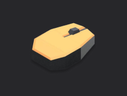

# Framework Operator UI



Interactive interfaces with input and display.

## What's Inside

- `procedure.yaml`: defines two phases with UI components
- `phases/run_test.py`: updates display components during execution
- `pyproject.toml`: uv-managed Python project

## Get Started

1. Sign up for a free TofuPilot account at [tofupilot.app](https://www.tofupilot.app/auth/signup).
2. Open the **New Procedure** flow in the dashboard and clone this template.
3. Follow the dashboard's instructions to set up a station and run the procedure.

For deeper guides, see the [TofuPilot docs](https://www.tofupilot.com/docs/framework).

## Structure

```
.
├── procedure.yaml
├── phases/
│   └── run_test.py
├── pyproject.toml
└── README.md
```
